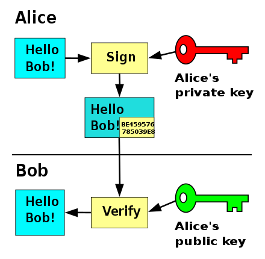
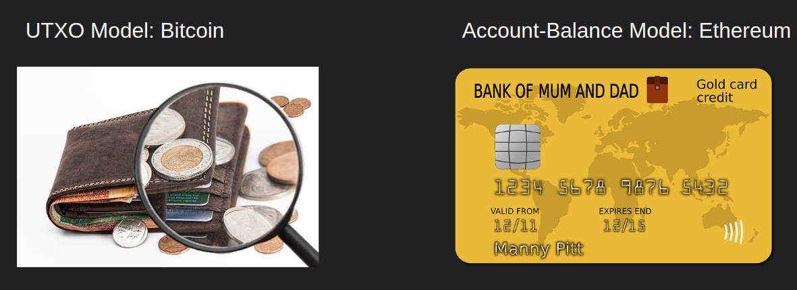
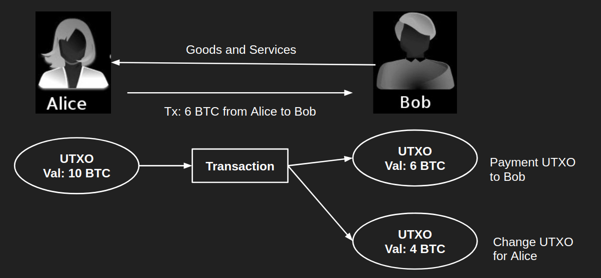

# EVM FAQs

#### Q. What is the sequence of private key, public key & address? What is their relation between them?
Generation sequence:

* `private key` -> `public key` -> `address`

But, not vice versa.

##### 1. private key

> Ethereum Private Keys are 64 random hex characters or 32 random bytes.

A private key in Ethereum is nothing else than 64 random hex characters. As a short reminder: Hexadecimal is going from 0 to F, which is 0 to 15 in decimal numbers. So there are 64 random values between 0 and 15, or 0 to F. That translates to 256 bits or 32 bytes.

You could literally go in and create your own private key, let’s say 0xFF00FF00FF00FF00FF00.. And so on. The trick here is to make it really random. So nobody can guess it. And that is why you should not create your own private key yourself from the top of your head.

##### 2. public key

>  'private key' -> 'public key' (`secp256k1` signing algorithm with ECDSA).

The public key is for the public, the private key is always only for you.

> The private key creates a signature. The public key verifies the signature.

Here, the person/EOA encrypts a transaction (actually a message in JSON format) with `private key`.

THe verifier decrypts the encrypted transaction using `public key.`

##### 3. address

The address is obtained via these 2 steps:

a. Hashing the public key i.e. `keccak-256(<public_key>)`. Then, you should get a `64` characters long string. That are `32` bytes.

> keccak-256 comes under SHA-3 family.

b. Snip last `20` bytes from that hashed `32` bytes. And then just add '0x' at the start of the address.

#### Q. How is private key handled by a wallet during sending transaction to a network?
The private key is encrypted (symmetric) by a password (stored in the device).

#### Q. How does a private key create a signature which is then verified by public key?
First a simple example: sign a document via _DocuSign_.

1. Whenever any document is supposed to be signed by a person with email-id,
2. The person owning the email-id, shall have to login & access the file. And then make a signature on the doc.

Similarly, in Blockchain world, the public key is the identifier of a person. But, to verify the public key ownership, one has to have the private key. So, then the person unlock the wallet (where the private key is stored). And then signs the transaction i.e. encrypt the transaction with the private key. The encrypted transaction when reaches to the block producer, then it is decrypted by the public key (publicly available to everyone).

__Analogy__:

1. Document <--> Transaction
2. Email id <--> Address (or public key in other blockchains like EOS, WAX)
3. Login password, OTP <--> private key
4. Handwritten signature done digitally <--> cryptographic signature

Alice signs a message—"Hello Bob!"—by appending to the original message a version encrypted with her private key. Bob receives both the message and signature. He uses Alice's public key to verify the authenticity of the message, i.e. that the encrypted copy, decrypted using the public key, exactly matches the original message.

Read more:

- [Digital Signatures and Blockchain: How DocuSign Does It](https://www.youtube.com/watch?v=Y0QcB0nkWoo)

#### Q. Is Ethereum based on UTXO model? If not, which one?
No.

It is based on Account-Balance model.
	- __Pros__: can be Smart contract compatible
	- __Cons__: double spending problem which is handled by introducing `nonce` for every address (from where the transaction has been requested).

For more, Read these:

- [Cryptoeconomics - 1.4 - UTXO Model](https://www.youtube.com/watch?v=-xoCoZGJ9AQ)
- https://medium.com/bitbees/what-the-heck-is-utxo-ca68f2651819

#### Q. What is UTXO? How is it different from Account-Balance model, used in Ethereum?

In the real-world, the UTXOs are almost similar to physical cash/coins. When one tries to spend cash in a shop, he gives up the entire note, takes the goods, and takes back the remaining change. If one has a cash note of 10 bucks and wants to buy good priced 5 bucks, he doesn’t divide the note in half for the payment. Rather he gives up the full note, and takes a new 5 bucks note as a change along with the goods.

UTXOs work in similar fashion. In a transaction, UTXOs are always consumed in full, even if the required payment is of the partial value of the original UTXO. For example, referring to the figure above, suppose Alice wants to pay Bob for some goods/services which cost 6 BTC. But Alice only has a single UTXO of 10 BTC. She will create a transaction that will consume up this whole UTXO of 10 BTC and create two new UTXOs, one for Bob with 6 BTC and one for herself with 4 BTC value. The UTXO Alice pays to herself is known as the change UTXO, and her wallet software automatically tracks this UTXO to give her the final balance of 4 BTC. Every time a payment is made for a smaller value than the available UTXOs, the wallet automatically creates the change UTXO for the user.

##### About

- UTXOs are locked up box full of coins.
- The lock can be opened by providing the right key.
- When you spend some bitcoin, you create a transaction (or the wallet does it for you) that consumes some old UTXOs and creates a bunch of new UTXOs.
- UTXOs are always consumed as a whole, and change UTXO is created automatically by your wallet to get back the balance.
- Every UTXO is associated with an address. Different types of address denotes different types of UTXOs.
- You should always be aware of your keys to open up the lock in your UTXO. Not Your Keys, Not Your Coins.

##### Comparo
* _Pros_: UTXO feels inherently similar to physical cash, whereas, in digital payment platforms, we deal with accounts.
* The account model is simply, where users have one or multiple accounts, the amounts can be anything, and there is no concept of change back. Credit is added to the balance, and debit is subtracted away.
* _Pros_: UTXO models are better for scalability and privacy. The transaction logic is simplified as each UTXO can only be consumed once and as a whole. Because the logic is simpler, transaction verifications can be made parallel.
* _Cons_: UTXO model is inherently unintuitive thus most of the wallets had to abstract away the UTXOs and simulate normal account like UI for users.
* _Cons_: UTXOs are limited in terms of more exotic smart contracts that executes based on the user’s total account balance. Because of these reasons, Ethereum rejected the UTXO model and they went for a simple and more flexible account-balance model.

> NOTE: But in the end, they both have their tradeoffs.

#### Q. What is Total supply, Max supply, circulating supply?
__Max supply__: tokens that will ever be generated

__Total supply__: tokens that exist currently = `circulating + locked - burned`

__Circulating supply__: tokens that are in circulation i.e. liquid amount like tradable,

__Locked tokens__: tokens that are staked or locked into some contract i.e. non-liquid

> Noticing the supply of a token can be a good indicator of its future. The circulating supply of a token is increased by developers by active mining. If the circulating supply keeps increasing, then investors can expect the value of the token to go up. On the contrary, if too many tokens are released, the value might drop as well.

__Marketcap of a token__: `Market price * circulating supply`

Small-cap cryptocurrencies are therefore riskier. While large-cap cryptocurrencies often potentially guarantee better returns and safety.

#### Q. What are the factors which impact the resource requirements of running a node in a decentralized network?
- Bandwidth: The cost of downloading and broadcasting any blockchain-related data
- Compute: The cost of running computations inside scripts or smart contracts
- Storage: The cost of storing transaction data for indexing purposes, and the cost of storing “state” in order to continue processing new blocks of transactions.

#### Q. What are the 2 ways to measure performance?
- Throughput: Transactions per sec (TPS)
- Latency (processing time of a transaction)

#### Q. how to determine a transaction hash is already mined/added to a block without searching in a block explorer?
FYI, a transaction hash can be created by having the params (from, to, data, value, ...). But, might not have been added to a block. In order to determine that, the transaction hash could be checked with the merkle proof & root hash. And these could be found via downloading a lightclient version of Ethereum Blockchain. The light client has all the block headers. And this block headers are the hashes of the big Merkle tree with genesis block header being the root hash.

> NOTE: Dependency on a block explorer is not recommended, as it is a central entity and might have delayed information.

#### Q. which public-key/assymetric encryption is used in Ethereum Blockchain?
Elliptic Curve Digital Signature Algorithm (ECDSA) is used in generating public-private key pairs.

> NOTE: Using private key, public key can be determined, but not vice versa.

__Info__: Instead RSA is not used, as it provides 3072-bit public key unlike 256-bit in ECDSA.

#### Q. which cryptographic hash function is used in Ethereum Blockchain?
keccak-256, unlike SHA-256 (used in Bitcoin)

#### Q. What is the format name that is used to serialize a transaction object?
RLP (Recursive Length Prefix) is to encode arbitrarily nested arrays of binary data, & RLP is the main encoding method used to serialize objects in Ethereum. It is used to encode structure; encoding specific data types (eg. strings, floats).

#### Q. What are the 3 main ways to scale Ethereum?
1. L1 scaling
	- Consensus protocol improvements: Here, reduce the block time in PoS, DPoS, etc.
	- increase the amount of data contained in each block i.e. no block size limit like in Bitcoin there is block size limit of 1 MB.
	- Sharding: intends to maximize the processing of transactions in terms of speed i.e. reducing the latency.
2. Building on top of L1 - L2 scaling
	- Roll-ups
		+ optimistic
		+ zk
3. Building on the side of L1 - sidechains

#### Q. Is Sharding a L1 scaling solution? If yes, what is Shading?
Yes.

Sharding is another layer 1 scaling solution that breaks down the job of authenticating and validating transactions into smaller pieces. It spreads the workload better across the peer-to-peer (P2P) network to bring in more computing power from more nodes. This all allows for blocks to be completed faster.

Basically, here instead of an authorized node (selected for adding/processing transaction to block), it is broken further into distinct datasets called "shards". These shards are simultaneously processing in parallel by the network, allowing for sequential work on numerous transactions.

#### Q. How many types of L2 roll-ups are there?
Rollups are solutions that perform transaction execution outside the main Ethereum chain (layer 1) but post transaction data on layer 1. As transaction data is on layer 1, rollups are secured by layer 1. Inheriting the security properties of layer 1 while performing execution outside of layer 1 is a defining characteristic of rollups.

It has 3 main properties:

1. transaction execution done outside the blockchain
2. transaction data or proof is available on the blockchain
3. a roll-up SC in L1 that can enforce correct transaction execution on L2 using the transaction data on L1.

<u>Optimistic</u>: 

- __Off-chain execution + on-chain data + fraud proofs__
- roll up many off-chain transactions into batches but w/o using ZK proofs. These rollups optimistically assume transactions are valid unless successfully challenged through fraud proofs.
- Computations are run only when fraud is suspected. 

<u>Zero-knowledge (ZK)</u>:

- __Off-chain execution + on-chain data via zk-SNARKs__
- roll up many off-chain transactions into a single verifiable batch with a zk-SNARK, a special cryptographic proof. These small validity proofs are then efficiently posted to the Ethereum blockchain.
- Here, transactions are computed off-chain and get bundled up to be posted to layer 1 with a validity proof.

<u>Validium</u>:
- Similar to ZK rollups, Validium uses validity proofs, but does not post transaction data onto Ethereum layer 1.

Read more:

- https://ethereum.org/en/developers/docs/scaling/layer-2-rollups/
- https://finematics.com/rollups-explained/
- https://hackernoon.com/polygon-vs-optimistic-and-zk-rollups-an-in-depth-comparison-dn2035c6
- https://research.paradigm.xyz/rollups

#### Q. What is nonce?
A nonce is an abbreviation for “number only used once,” referring to the total number of confirmed transactions sent `from` the given Ethereum address.

> NOTE: nonce is generally defined in a transaction struct/data for slow networks like Bitcoin, Ethereum (PoW networks)to prevent "double spending".
> Double spends are possible if you can mine blocks faster than the rest of the network and can "switch" the active longest chain.

#### Q. How to get total no. of confirmed transactions done by an address?
Get the nonce value of an address.

#### Q. How to get total no. of confirmed transactions done from/to an address?
M-1: Use API which get the data from node (stores transactions into a regular database like `postgres`).
M-2: Download the Blockchain data into a traditional database format (like `postgres`, `Redis`, etc.) & then make a query for an address >> store into array >> get the array length.

#### Q. how to cancel a unconfirmed/pending transaction?
This is when you want to ‘undo’ your transaction (in pending state). You don’t want it to go through, so you generate a 0 ETH transaction to your own address with the purpose of preventing a previous transaction from “going through” / “being mined” / being included in the blockchain.

Before sending this second transaction, users need to note the nonce being used by the original pending transaction and then reuse the same nonce they noted.

#### Q. what is EIP-1559?
#### Q. how is address determined from mnemonics?
#### Q. why eth has gas cost, but not Bitcoin?

#### Q. Can a contract initiate a transaction?
Never. It can only be initiated by an EOA.

They have code and must execute their function if an EOA or another contract sends a transaction.

#### Q. Does contract is charged gas fee when making a transaction like transfer ETH from contract to caller?
Never.

All transactions begin with a transaction signed by an EOA. If it goes to a contract, that contract may do stuff. The signer pays for gas. That contract may send a message to another contract making it do stuff. The signer still pays for the gas. And so on. No matter how long the chain of contracts and messages is, the original signer pays for all gas. [Source](https://ethereum.stackexchange.com/questions/42349/does-it-cost-gas-when-sending-ether-from-a-contract-to-an-address?rq=1)
